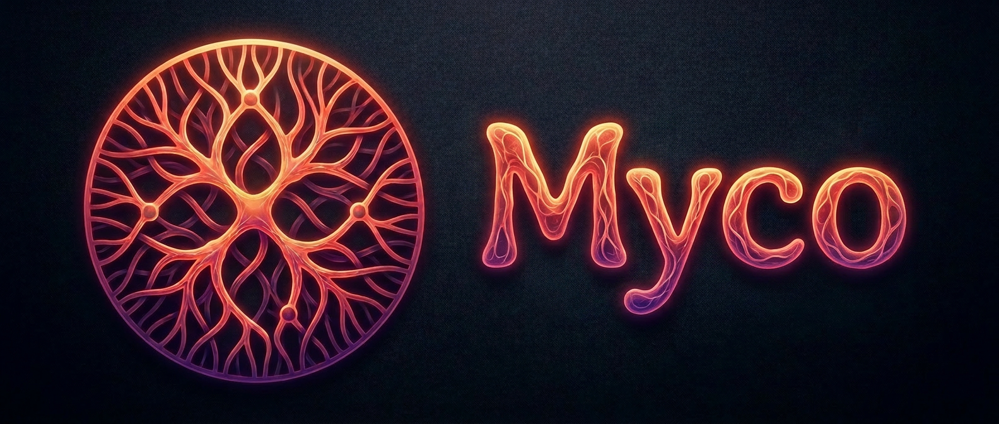
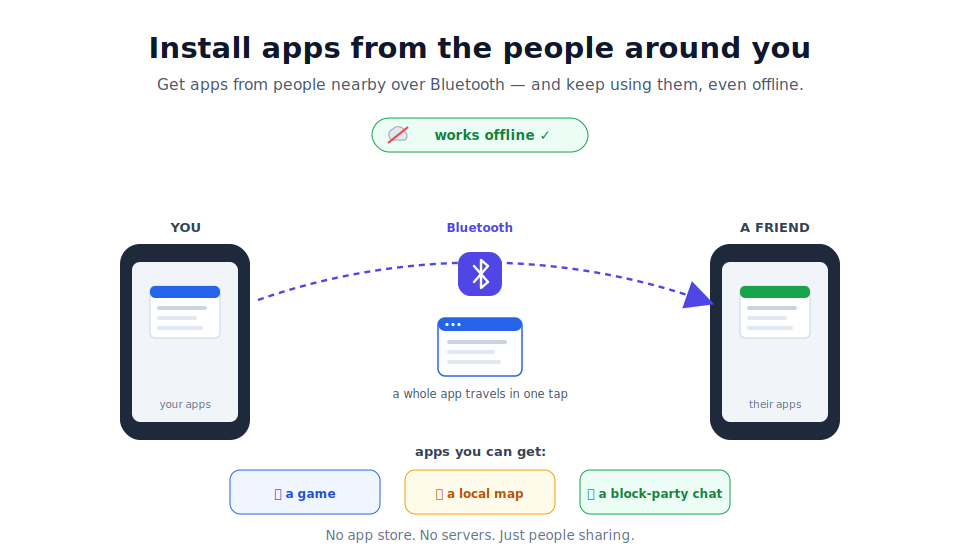
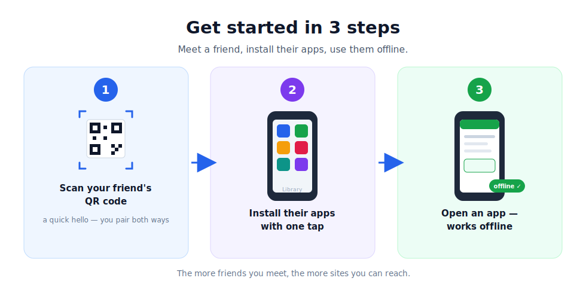
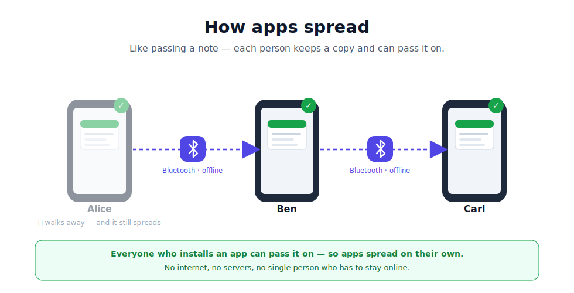
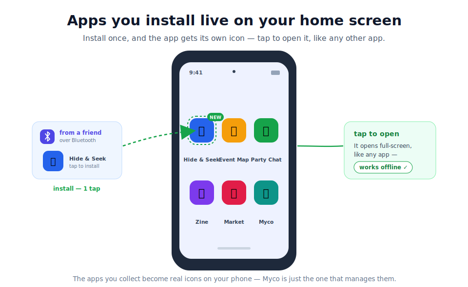
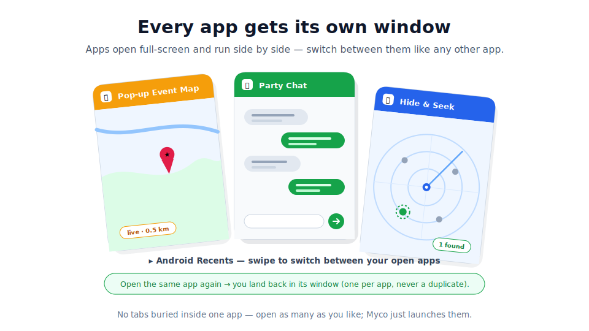

# Myco

> **Install apps from the people around you** — over Bluetooth, with no internet
> and no app store.

Myco is a peer-to-peer app-sharing network. Meet someone, **pair** with a quick
QR scan, and their apps land in your **Library**, ready to use offline. Pairing
always goes both ways: the code you scan carries a one-time invite, so the moment
you connect, apps can flow in either direction between you. Anything you install
you can pass on to the next person — so apps spread from phone to phone, on their
own, with no servers and no single point that has to stay online.

The apps you collect get their own home-screen icons, and each one opens
full-screen as its own app:

## How it works (for developers)

Under the hood, an "app" is an **nsite** — a static web app published on Nostr.
**Installing** an app means syncing and caching its author-signed files so it
runs offline; **passing it on** is your device re-serving those same signed files
to the next person. Apps travel over a **FIPS** mesh — including fully offline
over **Bluetooth (L2CAP)** — with an embedded Nostr relay + Blossom server on
each device. The reusable content layer (relay + Blossom + gateway + sync) lives
in a standalone `nsite-deck` crate; the Myco app crate `myco-core` wires it to
FIPS, BLE, and the Android shell.

Full design docs are in **[docs/](docs/README.md)**:

- [Concepts & glossary](docs/design/concepts.md) — start here
- [Architecture](docs/design/architecture.md)
- [The nsite layer](docs/design/nsite-layer.md) · [Propagation](docs/design/propagation.md) · [BLE interop](docs/design/ble-interop.md)
- [Identity & pairing](docs/design/identity-pairing.md) · [Security](docs/design/security.md)
- [Roadmap](docs/roadmap.md)

## Status

**Design phase — not yet built.** This repository currently holds the design
docs and diagrams. The v1 target is a two-device Android demo over Bluetooth,
fully offline — one phone browses an app installed from the other. See the
[roadmap](docs/roadmap.md).

> Built on [nostr-vpn](https://github.com/mmalmi/nostr-vpn) (FIPS data plane),
> reusing the [FIPS](https://github.com/k0sti/fips) mesh, and reimplementing the
> nsite-deck content layer in Rust.
