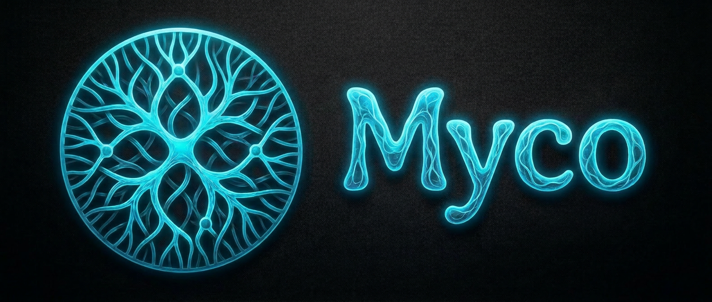
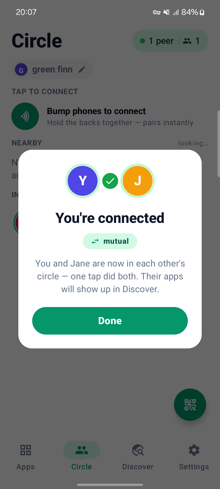
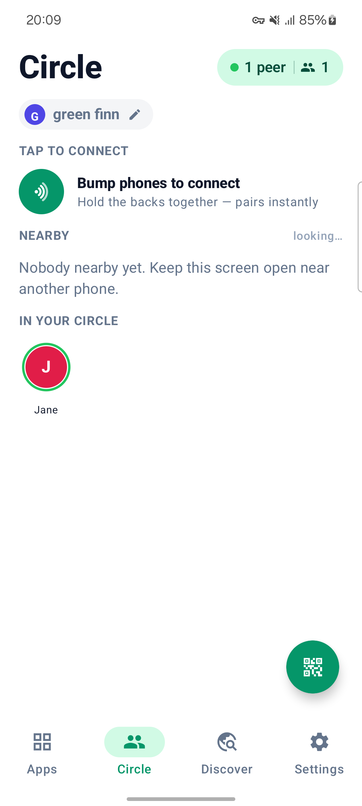
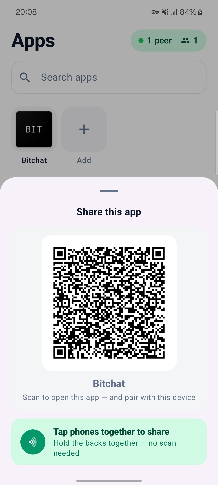
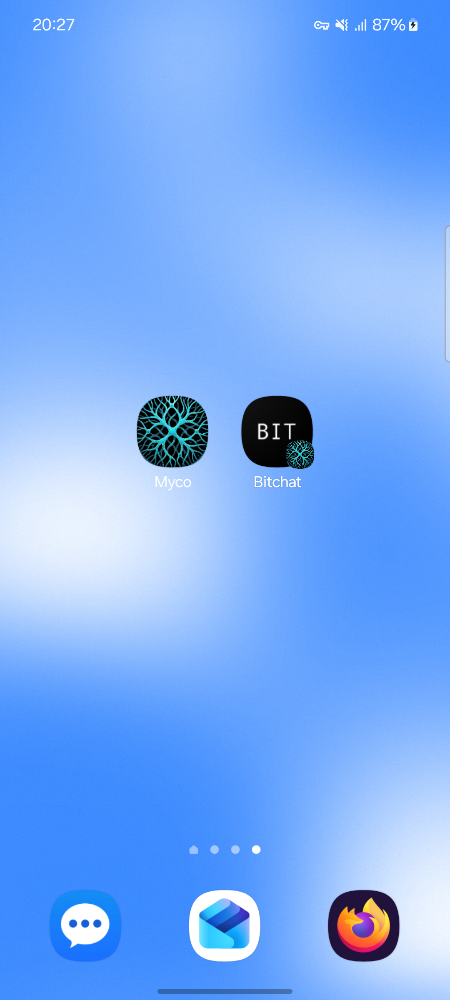
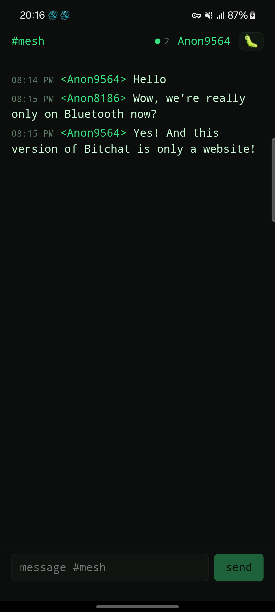
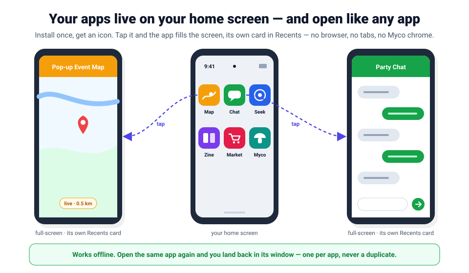

# Myco

> **Install apps from the people around you** — over Bluetooth, with no internet
> and no app store.

|  |  |  |  |  |
| :--: | :--: | :--: | :--: | :--: |
|  **Bump phones to pair** |  **Your Circle** |  **Share an app** |  **Your apps** |  **Apps run full-screen** |

Myco is a peer-to-peer app-sharing network. The apps you collect get their own
home-screen icons, and each one opens full-screen as its own app — no browser,
no tabs, works offline.

Meet someone, **pair** with a bump or a QR scan, and their apps land in your
**Apps** grid. Pairing always goes both ways: the code carries a one-time
invite, so the moment you connect, apps can flow in either direction between
you. Anything you install you can pass on to the next person — so apps spread
from phone to phone, on their own, with no servers and no single point that has
to stay online. What you do *inside* an app — a chat, a doorbell — travels the
same way, to the people you paired with and no one else.

## How it works (for developers)

Under the hood, an "app" is an **nsite** — a static web app published on Nostr.
**Installing** an app means syncing and caching its author-signed files so it
runs offline; **passing it on** is your device re-serving those same signed files
to the next person. Apps travel over a **FIPS** mesh — including fully offline
over **Bluetooth (L2CAP)** — with an embedded Nostr relay + Blossom server on
each device. The reusable content layer (relay + Blossom + gateway + sync) lives
in a standalone `nsite-deck` crate; the Myco app crate `myco-core` wires it to
FIPS, BLE, and the Android shell.

Full design docs are in **[docs/](docs/README.md)**:

- [Concepts & glossary](docs/design/core/concepts.md) — start here
- [Architecture](docs/design/core/architecture.md)
- [The nsite layer](docs/design/nsite/nsite-layer.md) · [Propagation](docs/design/nsite/propagation.md) · [BLE interop](docs/design/fips/ble-interop.md)
- [Identity & pairing](docs/design/core/identity-pairing.md) · [Security](docs/design/core/security.md)
- [Deep links](docs/design/core/deep-links.md) — linking to a place inside an app, and what happens when that app isn't installed yet
- [Roadmap](docs/roadmap.md)

## Status

**Built and in daily use on two phones.** Pair by bumping phones (NFC) or
scanning a QR, and apps flow both ways over Bluetooth, Wi-Fi Aware or the LAN
with no internet. Two kinds of app run: **nsites** (static sites published on
Nostr) and **napplets** (sandboxed programs with a permission model — mesh,
relays, pictures). See the [roadmap](docs/roadmap.md) for what's next and
[docs/](docs/README.md) for how it works.

> Built on the [FIPS](https://github.com/jmcorgan/fips) mesh, with an embedded
> Nostr relay and Blossom store in Rust and a Compose shell in Kotlin.
