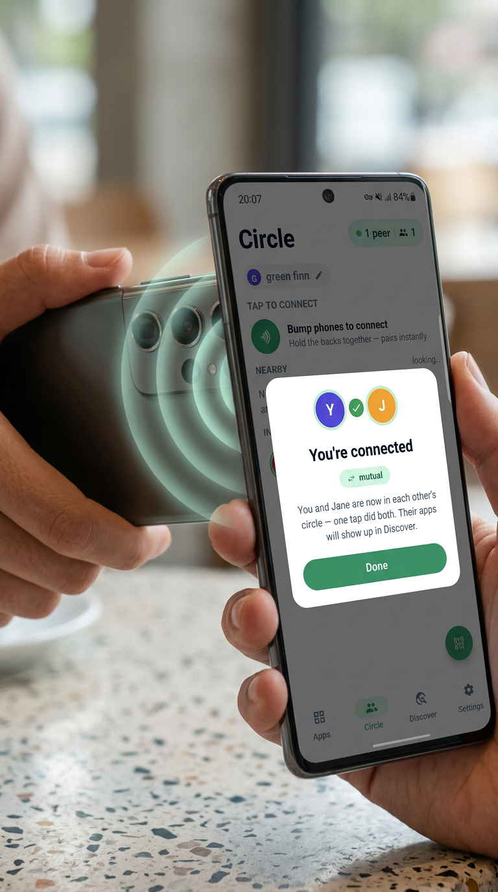
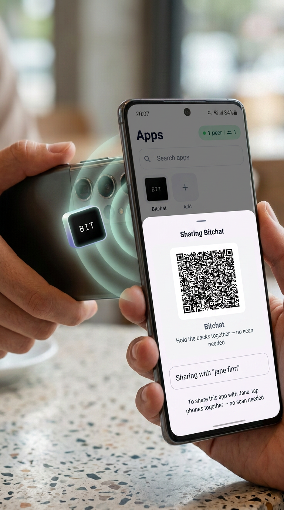
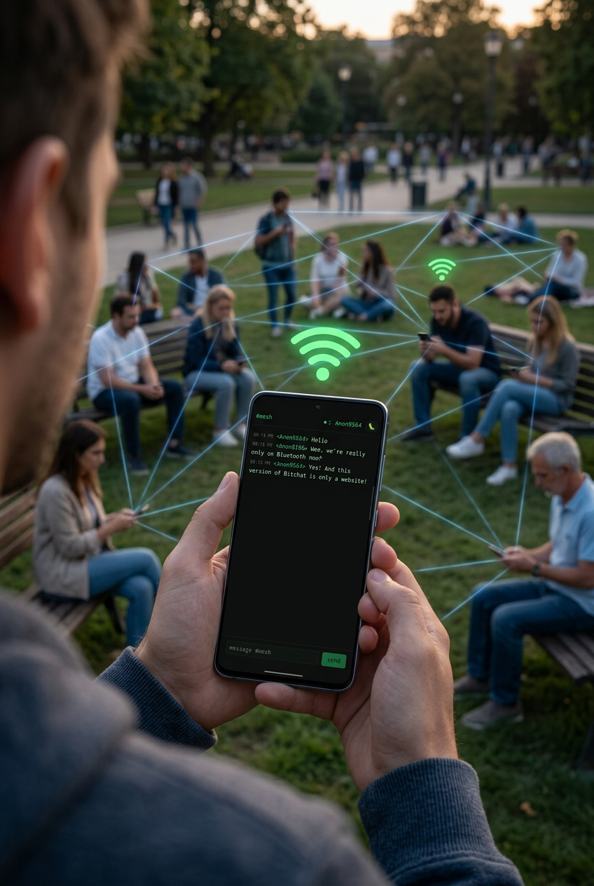
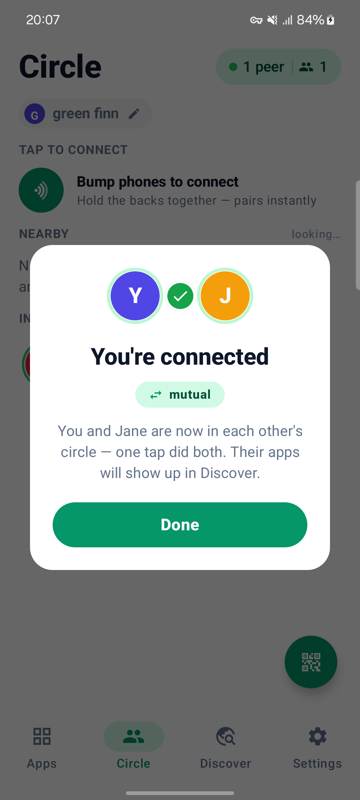
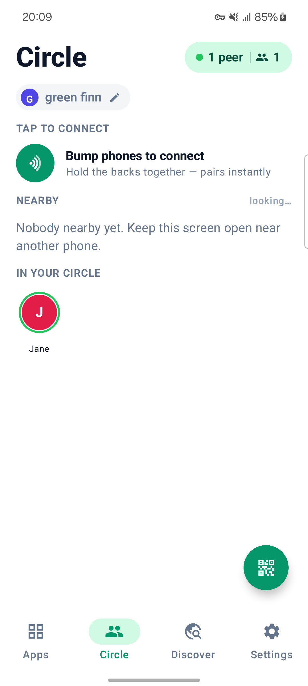
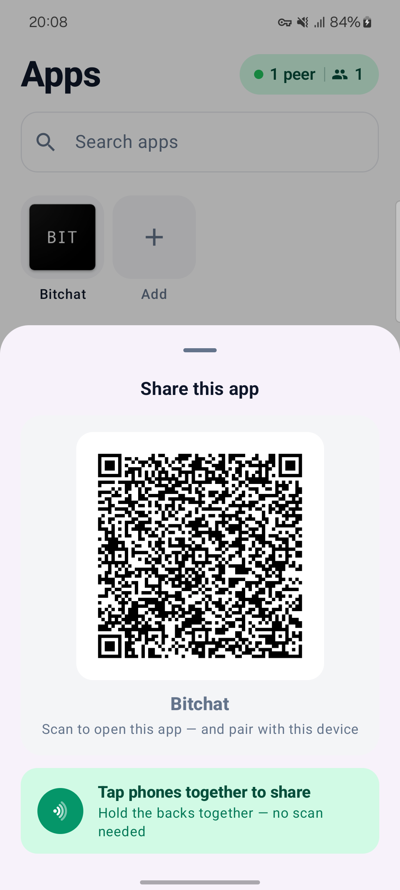
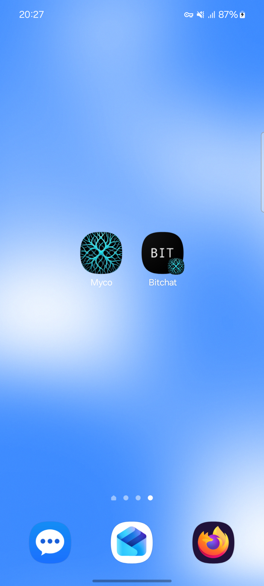
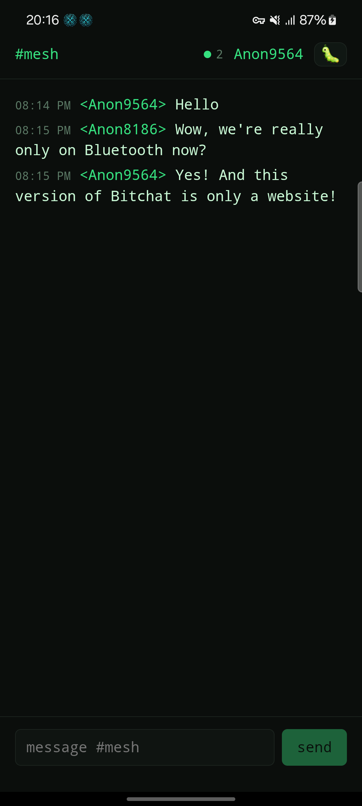

# Myco

> **Hand a useful app to the people around you.** Phone to phone, and it
> keeps opening when the internet is gone.

Someone in the room has an app that helps: a schedule, a checklist, a game, a
way to ring each other. With Myco they bump phones with you, and the app is on
your phone too. It opens full-screen like any other app, and it still opens
with no signal. Once you have it, you can hand it on to the next person.

|  |  |  |
| :--: | :--: | :--: |
|  **Bump phones to pair** |  **Hand over an app** |  **Use it together, offline** |

|  |  |  |  |  |
| :--: | :--: | :--: | :--: | :--: |
|  **Bump phones to pair** |  **Your Circle** |  **Share an app** |  **Your apps** |  **Apps run full-screen** |

## What you can do with it today

- **Pair** by bumping phones (NFC), tapping someone Myco found nearby over
  Bluetooth, or scanning a QR code.
- **Hand over an app.** The other phone pulls it straight from yours.
- **Open it with no internet**, full-screen, from the Apps grid or a
  home-screen icon.
- **Pass it on.** The phone that received it can share it with someone else,
  even when you have left.

All of this is tested with every phone in airplane mode and Bluetooth on
([the runbook](docs/how-to/run-two-device-demo.md)).

What Myco does not do yet:

- It is **Android only** (Android 10 or newer, 64-bit ARM phones).
- **Myco itself** comes from a download, not from another phone. See
  [Get Myco](#get-myco). Sharing Myco from inside Myco is on the
  [roadmap](docs/roadmap.md#n11--share-myco-itself).
- Phones find each other **only while Myco is open on screen**. A phone in a
  pocket finds nobody.
- **Mesh over the internet** is opt-in (Settings › Mesh › Internet) and not
  yet tested on two phones on different networks. It links to public FIPS
  nodes, which see your phone's IP address but not what you send
  ([how it works](docs/design/fips/public-mesh-nodes.md)).

## Pick your way in

- **[Someone is handing me an app](#join-a-group)** — what to do, and why.
- **[I want to get an app to my group](#organize-a-group)** — setup, and what
  keeps working offline.
- **[I build apps](#build-apps-for-myco)** — what to build, and how it
  travels.

---

## Join a group

**Someone near you uses an app that helps with what you are doing together.
Myco lets them hand it to you in person.**

1. **[Get Myco](#get-myco)** on your phone. This step needs a download.
   Android asks whether your browser may install apps. Allow it for this
   install.
2. **Open it and tap "Yes, I want mesh".** Android then asks twice:
   - **Nearby devices**, to find the phones around you. On Android 12 and
     older this includes **location**: Android requires it to scan for
     Bluetooth. Myco does not record where you are.
   - **A VPN prompt.** The VPN stays on your phone. Myco uses it to talk to
     other phones, not to send your traffic anywhere.

   The **camera** is asked for only when you scan a code. **Notifications**
   are optional: turn them on in **Settings › Permissions**.
3. **Pair**, in the **Circle** tab. Any one of these:
   - **Bump:** hold your phone back to back with theirs.
   - **Nearby:** tap them in the list of phones Myco found over Bluetooth,
     and they accept.
   - **QR:** they tap **Show my code** and you tap **Scan**.
4. **Receive the app.** They long-press the app and tap **Share**. You bump
   phones again, or scan the code on their screen from **Apps › +**. Scanning
   that code also pairs you, so you can skip step 3.
5. **Open it.** It lands in your **Apps** grid. Some apps first list what they
   want to use, such as nearby phones or your pictures. You choose.

After that the app is yours. It opens without internet, though what it can
show offline depends on the app. You can share it with the next person the
same way.

### What pairing lets the other person do

Pairing works both ways. The person you pair with can:

- get the apps on your phone,
- read what your apps shared with nearby phones,
- offer you files.

Nothing else on your phone is open to them, and people you have not paired
with get nothing. To undo it, tap them in **Circle** and choose **Remove from
circle**.

## Organize a group

**Can you get a useful tool to the people here, and keep using it without the
internet? Yes. Here is one full run you can repeat.**

### Example: a workshop app

You run a half-day workshop in a hall with poor signal. The group uses a
[napplet](#build-apps-for-myco) (a small app), say a checklist everyone ticks
off together. It is passed between the phones in the room, and each phone
picks up the latest ticks from the phones near it, even after joining late.

**Before the day, with internet:**

1. Install [Myco](#get-myco) on your own phone.
2. Add the app. Find it in the preinstalled **AppStore** app. Or, if its
   maker sent you a link (it starts with `naddr`), go to **Apps › +** and
   paste it. Review what it asks for and tap **Add to my apps**. Every file
   is now on your phone.
3. Ask people to install Myco before they come. Send them
   [Join a group](#join-a-group): it explains the permission prompts,
   including the VPN one.

**On the day, no internet needed:**

1. Keep Myco open on your screen.
2. Share the app with the first few people. Open the app's **Share** screen
   and let them scan the code or bump phones. That pairs you and hands it
   over in one go.
3. **Let it spread.** Everyone who has the app can share it the same way. You
   don't need to reach every person yourself, and people who arrive late can
   get it from whoever is next to them.
4. Each person reviews what the app asks for, and opens it.

### What keeps working offline

| Works with no internet | Needs the internet |
| --- | --- |
| Pairing, while both phones have Myco open | Installing Myco itself |
| Handing an app to someone you paired with | Adding an app nobody here has yet |
| Opening any app already on your phone | Public Nostr content, like profiles and the AppStore feed |
| Apps built to talk over nearby phones, while those phones are in reach | Anything an app loads from the web |

### Know before you rely on it

- Phones must be close, and Myco must be on screen, to find each other.
- **Bluetooth is slow for big apps.** Keep what you hand out small, or add it
  before the day. Phones on the same Wi-Fi network use it, and that is faster.
- Myco is not an emergency radio. It does not promise that a message gets
  through, and it cannot confirm that a message came from an organizer.

Try it on two phones first:
[the runbook](docs/how-to/run-two-device-demo.md).

## Build apps for Myco

**What can you build, what can it use, and how does it reach people?**

### Napplets

A **napplet** is a small program in a sandbox
([napplet.run](https://napplet.run), NIP-5D). It is what Myco is built to
run. It asks Myco for what it needs, and gets only what the person grants:

- an identity to sign as,
- Nostr relays: this phone's own relay, and public ones when online,
- the mesh: publish to and read from nearby paired phones, up to a hop limit
  the person sets,
- pictures and files by content hash, from this phone, a paired phone, or
  public servers,
- other apps, by role: "open this profile" opens the person's profile app,
  the one they chose as the default, or the one they pick when asked.

### nsites, as a bonus

An **nsite** is a static website published on [Nostr](https://nostr.com).
Myco stores its signed files and shows them, so any nsite works offline once
it is on the phone. It asks for no permissions and gets no mesh.

### Sharing an app is not syncing its data

Myco copies an app's files from phone to phone. It does not make an app
collaborative on its own. For people to work together offline, a napplet uses
the **mesh** capability:

- **Publish** stores a note on this phone and floods it to paired phones, up
  to the hop limit.
- **Subscribe** returns matching notes this phone already holds, then asks
  phones within the hop limit for theirs. So a phone that joins late catches
  up from the phones near it.
- **Ephemeral notes** (with a NIP-40 `expiration`, such as chat) disappear
  once they expire, so catch-up is only possible until then.

A napplet can also **keep** a note or picture it was shown on this phone, and
**pass on** a note it was shown to nearby phones or public relays again — only
ever what it was shown, never signed as you.

With your OK on the install sheet, a napplet can also **upload** a file, such
as a picture to post, to your Blossom servers, signed as you.

### From a small example to two phones

1. **Build** a single-file napplet, following
   [napplet.run](https://napplet.run). (Or a static site, for an nsite.)
2. **Publish** it to Nostr. (An nsite: `nsite-cli upload dist`.)
3. **Add it** on one phone while online: **Apps › +**, then paste its
   `naddr` (or the nsite's link).
4. **Hand it over** to a second phone in airplane mode, and open it there.
   Follow [the two-phone runbook](docs/how-to/run-two-device-demo.md).
5. **Test the offline part on real phones.** Bluetooth, NFC and the mesh
   need real hardware. Emulators are not supported.

### How it works underneath

Every phone runs its own Nostr relay and Blossom file store, and keeps the
signed files of every app it holds. That is why a phone that got an app can
hand it on. Phones connect over a [FIPS](https://github.com/jmcorgan/fips)
mesh: Bluetooth (L2CAP), Wi-Fi Aware, the local network, or the internet when
there is one. Links are encrypted. The Circle — the people you paired with —
decides who may pull from your phone.

The reusable content layer (relay, Blossom, gateway, sync) is the
`nsite-deck` crate. `myco-core` wires it to FIPS and the Android app.

Read on:

- [Concepts & glossary](docs/design/core/concepts.md) — start here
- [Architecture](docs/design/core/architecture.md)
- [Napplet runtime](docs/design/napplet/napplet-runtime.md) · [NAP-MESH](docs/design/napplet/NAP-MESH.md) · [NAP-INTENT](docs/design/napplet/NAP-INTENT.md) · [NAP-UPLOAD](docs/design/napplet/NAP-UPLOAD.md)
- [The nsite layer](docs/design/nsite/nsite-layer.md) · [Propagation](docs/design/nsite/propagation.md)
- [Identity & pairing](docs/design/core/identity-pairing.md) · [Security](docs/design/core/security.md)
- [Build from source](docs/how-to/build.md) · [All docs](docs/README.md) · [Roadmap](docs/roadmap.md)

---

## Get Myco

- **Download:** the APK from the
  [latest release](https://github.com/Origami74/myco/releases/latest), or
  through [Zapstore](https://zapstore.dev/apps/app.myco).
- **Installing the APK:** Android asks whether your browser (or file app) may
  install apps. Allow it, install Myco, and you can turn it off again.
- **Needs:** Android 10 or newer, on a 64-bit ARM phone. NFC is optional; QR
  works everywhere.

Myco cannot pass itself on from phone to phone yet
([on the roadmap](docs/roadmap.md#n11--share-myco-itself)). Each person needs the APK
before they can receive apps.

## Status

Myco is released and under active development: see the
[releases](https://github.com/Origami74/myco/releases),
[CHANGELOG.md](CHANGELOG.md) and the [roadmap](docs/roadmap.md). Every install
also has a Nostr account from the first launch: a guest you can keep, or
replace with your own `nsec` or a signer app such as Amber.

> Built on the [FIPS](https://github.com/jmcorgan/fips) mesh, with an embedded
> Nostr relay and Blossom store in Rust and a Compose shell in Kotlin.
