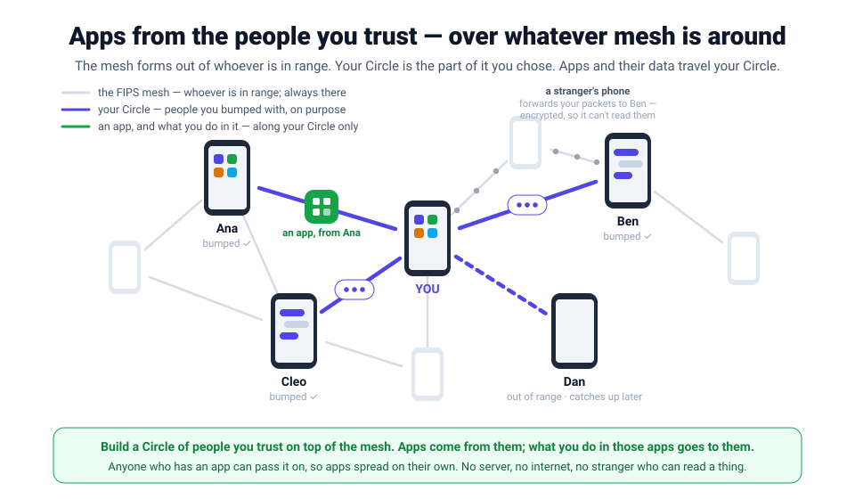
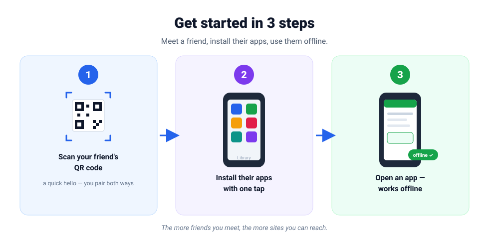
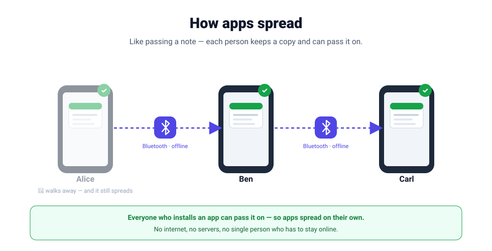
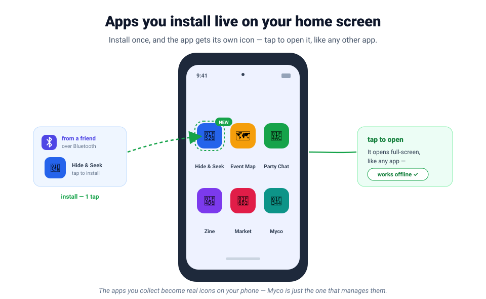
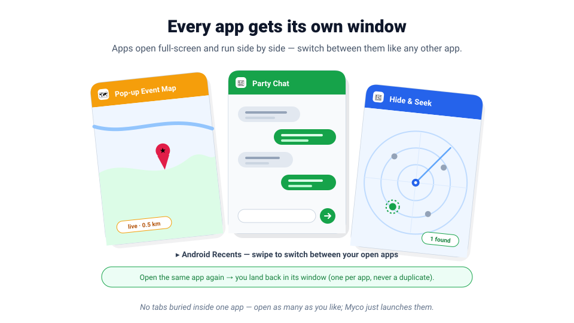

# Myco

> **Install apps from the people around you** — over Bluetooth, with no internet
> and no app store. Meet someone, scan their code, and their apps appear on your
> phone, ready to use offline. Anything you install you can pass on — so apps
> spread from phone to phone, on their own.

---

## What it is

Myco is a different kind of app store. Instead of downloading from a
company's servers, you **install apps from the people around you** — over
Bluetooth, with no internet connection.

Meet someone, **pair** with a quick QR scan, and their apps land in your
**Library**, ready to use offline. Anything you install you can pass on to the
next person, so apps spread from phone to phone on their own — no servers, no
single point that has to stay online.

## What you can install

Anything someone can build as a small app and hand to you in person — for
example: a tiny game · a field guide · an offline map · a zine reader · a
block-party chat · a community noticeboard · a local marketplace · a
lost-and-found.

## Pairing

Getting started takes one in-person hello:

1. Tap **Pair**.
2. **Show your code**, or **Scan a friend's** — a quick QR scan.
3. You're paired. They join your **circle**, their apps land in your
   **Library**, and you'll discover more apps through the people *they've*
   paired with.

Your code carries a **memorable name** — like *green sammy* or *blue james* — so
the people you pair with always remember who you are, and can double-check they
paired with the right person. Pairing can go both ways: a one-time invite makes
it mutual, so apps flow in both directions.

---

## For developers

Under the hood, an **app is an [nsite](./design/core/concepts.md)** — a static web app
published on Nostr. **Installing** an app means syncing and caching its
author-signed files so it runs offline; **passing it on** is your device
re-serving those same signed files to the next person. Because your embedded
relay is shared with the people you pair with, an app can also have a live
backend made of the people who have it. The rest of these docs is how that is
made to work over Bluetooth with no internet.

**Myco** is a peer-to-peer app-sharing network — an Android app for
exchanging, installing, and propagating nsites (static apps published on Nostr)
over a [FIPS](../reference/fips/docs/README.md) mesh, including fully **offline
over Bluetooth**. **Myco is the manager app** — Library, Pair, Discover, and
Settings; each nsite **launches as its own fullscreen app** (its own
WebView-backed task in Android Recents), with no Myco-imposed chrome — no URL
bar, no Back/Reload bar. The vision is nak's
"Pillars of Propagation": small relays and Blossom blobs hopping over crappy
links in all directions, surviving outages via local propagation. Myco is a
fork of [nostr-vpn](../reference/nostr-vpn/) with the private-network layer
stripped out, plus an embedded Nostr relay, an embedded Blossom server, the
fullscreen nsite app-shell, and native BLE peering.

The locked architecture in brief: the device has one **Nostr keypair** — its
**device identity** — that serves as the mesh identity (the address of this
device's relay+Blossom) and BLE link authentication, with
`node_addr = SHA256(npub)[0:16]` and an `fd00::/8` ULA derived from it. It is
**never** used to author nsites: nsites are authored **elsewhere** by external
tooling, and an nsite's **author** is a separate, external key that appears only
as the `<npub_author>.nsite` URL host and the `authors` filter in relay queries.
The app holds and serves authors' already-signed events but never holds their
secret key and never signs on their behalf. The backend is **Rust** — the
embedded relay (`ws://localhost:4870`), Blossom server
(`http://localhost:24243`), and FIPS endpoint are unified into one `myco-core`
crate behind a single JNI/JSON FFI surface. Kotlin owns the UI, the WebView, the
BLE radio, and the kept Android `VpnService`/TUN; the TUN routes only `fd00::/8`
and DNS-intercepts `*.fips` (→ `fd00::`, IPv6 mesh sync) and `*.nsite`
(→ `127.0.0.1`, the localhost gateway the WebView loads). The WebView never
resolves `.fips`; only relay/Blossom **sync** traffic does. Offline propagation
is **net-new at the nsite/relay layer** (FIPS transport is live-path only): your
local relay + Blossom retain authors' signed events and content-addressed blobs and
re-serve them, so your device becomes a new source. The first milestone (P1) is
BLE peering over FIPS — two devices forming an offline BLE link — and the v1
product headline (P4) is a two-device Android demo over BLE, fully offline: one
phone browses the other's nsite. See the [roadmap](./roadmap.md) for the phased
plan and [getting started](./getting-started.md) for orientation.

> These are **design docs for a not-yet-built app**, written in proposal voice.
> Open questions are marked **TBD / open**.

---

## Documentation index

### Design

Design docs are grouped by what they describe: `core/` for the system and its
identity model, `nsite/` for the content layer, `napplet/` for the app runtime,
and `fips/` for the transport lanes. Diagrams and UI mockups are shared.

#### `core/` — the system

| Doc | Description |
| --- | --- |
| [concepts.md](./design/core/concepts.md) | Canonical terminology and glossary: device vs nsite-author identity (and the device key's three derived forms), `.fips` vs `.nsite`, what an nsite is, the embedded relay+Blossom, and the Pillars-of-Propagation framing. Read this first. |
| [architecture.md](./design/core/architecture.md) | The six-layer single-device stack, the Kotlin↔Rust FFI boundary, the role of the kept TUN, and a per-component reused-vs-net-new provenance table. |
| [app-shell.md](./design/core/app-shell.md) | The app/launch model: Myco as the manager app (Library, Pair, Discover, Settings) versus each nsite as its own fullscreen `NsiteActivity` task; `myco://app/<host>` intents, Recents cards via `TaskDescription`, pinned home-screen shortcuts, and per-nsite origin isolation. |
| [deep-links.md](./design/core/deep-links.md) | `myco://app/<host>/<path>`: a link that names an app *and* a place inside it, carries no secrets, and works whether or not the receiving phone has the app yet. |
| [identity-pairing.md](./design/core/identity-pairing.md) | How a device establishes its identity and how two devices become peers: identity storage, the `myco://pair/<base64>` QR payload, peer-as-data-source, and transitive authorization via invite-pairing — the mandatory, always-mutual handshake (echo a one-time long-random secret over Noise + confirm; v1). |
| [event-gossip.md](./design/core/event-gossip.md) | Live event gossip: the push and pull planes that get an in-app Nostr client arbitrary app events over the mesh, the `MESH` envelope, the proxy-owned seen-set, and query ids. |
| [security.md](./design/core/security.md) | Trust model: self-authenticating data, inherited FIPS Noise crypto, dropping the membership roster, scan-and-confirm (handshake-mandatory) pairing, the nsite sandbox, and a threats/mitigations table. |

#### `nsite/` — the content layer

| Doc | Description |
| --- | --- |
| [nsite-layer.md](./design/nsite/nsite-layer.md) | The embedded relay, Blossom, and localhost gateway; the manifest/URL scheme; the resolve→cache→serve flow; and sync-over-FIPS that pulls a peer's manifest + blobs. |
| [propagation.md](./design/nsite/propagation.md) | Offline propagation: the live-path (FIPS) vs store-and-forward (nsite) split, the hybrid model (flood the author-signed manifest events, pull blobs on demand), transitive discovery, dedup/anti-loop, and cache retention. |
| [nsite-updates.md](./design/nsite/nsite-updates.md) | How a site gets a new version: discovery, staged download, activation, and mesh propagation of the update. |
| [nsite-permissions.md](./design/nsite/nsite-permissions.md) | Per-peer grants (built) and per-application capabilities (proposed): what a paired peer may do to this node, and what a served nsite may ask for. |

#### `napplet/` — the app runtime

| Doc | Description |
| --- | --- |
| [napplet-runtime.md](./design/napplet/napplet-runtime.md) | Napplets as NIP-5D manifests over the same NIP-5A shape nsites use, verified resolve into a sandboxed `srcdoc` iframe, the NAP capability seam and its origin-scoped transport, the shared Android-Intent/NAP-INTENT resolver, and `<npub>.fips` relay URLs that make the outbox model work over the mesh. |

#### `fips/` — transport lanes

| Doc | Description |
| --- | --- |
| [ble-interop.md](./design/fips/ble-interop.md) | BLE transport strategy: native `AndroidBleIo` (and a macOS `BluestIo` test backend) over fips-core's `BleIo` trait, why L2CAP not GATT, the PSM problem and universal per-peer PSM discovery, MAC randomization, and the foreground-service requirement. |
| [wifi-aware-interop.md](./design/fips/wifi-aware-interop.md) | Wi-Fi Aware (NAN) bulk-lane strategy: Kotlin raises the data path, fips-core's existing UDP transport dials the link-local address; the two fips-core patches (discovery injection, BLE↔Aware link policy), socket exposure, and why not Wi-Fi Direct. |
| [ap-lane.md](./design/fips/ap-lane.md) | The `!FIPS` open access SSID: joining a router's mesh over ordinary UDP when the phone is on such a network. |
| [usb-transport.md](./design/fips/usb-transport.md) | Proposed, not started: USB/AOA as a high-throughput phone-to-phone transport for seeding large sites. |

#### Shared assets

| Doc | Description |
| --- | --- |
| [diagrams/](./design/diagrams/README.md) | The design diagrams (system layering, pairing & transitive discovery, offline propagation, nsite browse flow) and the established facts baked into them. |
| [mockups/](./design/mockups/) | UI mockups for the Apps drawer, Circle, Settings, Dev screen, QR scan, and the get-an-app flow. |

### Reference

The exact wire formats, ports, kinds, config keys, and FFI contract — the
look-it-up surface.

| Doc | Description |
| --- | --- |
| [ports.md](./reference/ports.md) | The localhost ports (relay 4870, Blossom 24243, gateway) and exactly how each is — or is deliberately not — exposed over FIPS; the WebView/localhost vs sync-engine/`.fips` split. |
| [nostr-kinds.md](./reference/nostr-kinds.md) | The Nostr event kinds Myco reads, stores, and replicates: nsite manifests (15128 root / 35128 named) and FIPS discovery kinds. The app authors none of them. |
| [config.md](./reference/config.md) | The proposed `config.toml` model (identity, node, cache, peers, BLE, propagation, DNS), the field reference, and what is explicitly stripped relative to nostr-vpn. |
| [ffi-surface.md](./reference/ffi-surface.md) | The Kotlin↔Rust JNI/JSON reducer contract: opaque-handle lifecycle, the `dispatch(actionJson)→stateJson` reducer with a `rev` counter, the action/state shapes, and the BLE byte-bridge. |

### How-to

Task-oriented runbooks for building and demoing the app.

| Doc | Description |
| --- | --- |
| [build.md](./how-to/build.md) | Cross-compile the Rust backend with cargo-ndk and assemble the arm64 / minSdk 29 APK; wiring in the local `reference/fips` checkout via `patch.crates-io`. |
| [run-two-device-demo.md](./how-to/run-two-device-demo.md) | The v1 target runbook: two Android phones, fully offline (airplane mode, BLE on) — seed a sample nsite, QR-pair, bring up the BLE link, and browse one device's nsite from the other. |

---

## Where to start

- New here? Read [getting-started.md](./getting-started.md), then
  [concepts.md](./design/core/concepts.md).
- Want the build/run plan? See the [roadmap](./roadmap.md).
- Building it? [how-to/build.md](./how-to/build.md) →
  [how-to/run-two-device-demo.md](./how-to/run-two-device-demo.md).
- Upstream mesh: [FIPS docs](../reference/fips/docs/README.md).
