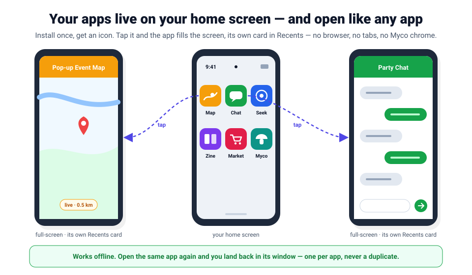
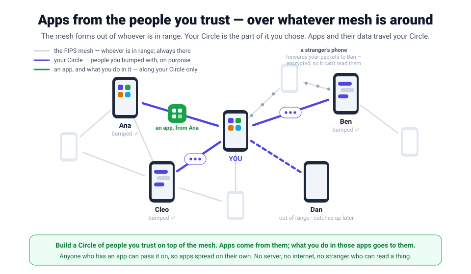

# Myco

> **Hand a useful app to the people around you.** Phone to phone, and it
> keeps opening when the internet is gone.

---

## What it is

Someone in the room has an app that helps: a checklist, a game, a way to ring
each other. With Myco they pair with you and hand it over, and the app is on
your phone too. It opens full-screen like any other app, and it still opens
with no signal. Once you have it, you can hand it on to the next person.

Apps travel over Bluetooth, Wi-Fi Aware or the local network, with no
internet needed. The [project README](../README.md) has the short version for
people joining a group, organizing one, or building apps.

## Napplets first, nsites as a bonus

- A **napplet** is a program: a sandboxed page with a permission model. It
  asks Myco for things — an identity, relays, the mesh, pictures — and gets
  exactly what you granted. It is a program Myco *hosts*, and what Myco is
  built to run.
- An **nsite** is a static website published on Nostr. Myco stores its signed
  files and serves them to a WebView, so it works offline once it is on the
  phone. It is a document Myco *serves*, and it gets no grants.

Both arrive the same way (a signed manifest plus content-addressed files),
both live in the same grid, both open as their own full-screen app.

## Pairing

Getting started takes one in-person hello. Open **Circle**, then:

- **Bump phones** (NFC), or
- **Tap them under Nearby**, where Myco lists phones it found over Bluetooth,
  and they accept, or
- **Show your code** and let them scan it.

You're paired — both ways. They join your **Circle**, and apps can flow in
either direction between you. Your name travels with the pairing so the people
you pair with remember who you are. Pairing is always mutual: the other phone
confirms, and only people you paired with can pull from your phone.

---

## For developers

Four layers, top to bottom. Each one only knows the one below it.

| Layer | What it is | Where |
| --- | --- | --- |
| **1. Apps** — nsites and napplets | The manifest and file model both share; the gateway that serves an nsite; the runtime that hosts a napplet and its capabilities (NAPs). | `nsite-deck`, `myco-napplet-runtime`, `NsiteActivity`, `NappletActivity` |
| **2. Circles and pairing** | Who you trust. A Circle is your list of paired people — a *virtual* mesh laid over the physical one, built on purpose, one mutual signed handshake at a time. It decides who may read your relay and store, whose apps you pull, and who a napplet's "everyone nearby" is. | `content.rs` (Circle, pairing, gate), `auth_service.rs`, `nfc/`, `share/` |
| **3. Relay and Blossom** | Your phone's own Nostr relay and blob store. Every app's data rests here; peers sync from here. Hop-limited gossip carries events between Circle members. | `myco-relay`, `myco-blossom`, `mesh_relay.rs`, `gossip.rs`, `peer_relay.rs` |
| **4. FIPS** | The mesh. Encrypted links between phones over BLE, Wi-Fi Aware, LAN or the internet; IPv6 addresses derived from device keys; `<npub>.fips` names. | `reference/fips`, `ble/`, `aware/`, `ap/`, the TUN |

**Pairing is not a FIPS peer.** Layer 4 will happily hold an encrypted link to
any phone running FIPS in range — that is a *peer*, and it says nothing about
trust. Layer 2's *pairing* is a Myco decision made by two people: it is what
lets a peer read your relay, pull your apps, and send you files. A phone can be
a connected FIPS peer and a stranger at the same time; the content ports refuse
it. A Circle member can be out of range; they are still in your Circle. The
docs use *peer* for layer 4 and *Circle member* (or *paired*) for layer 2, and
never swap them.

**Two keys, not one.** The **device key** is the FIPS mesh key, layer 4's
identity: the mesh address, the link authentication, the name of this phone's
relay (`<npub>.fips`). The **user key** is the Nostr key, the social one and
layer 1's: what a napplet publishes *as*. It is a guest key from the first
launch, or your own `nsec` or a signer app. Neither is ever an app author's key —
apps are authored elsewhere, and Myco only ever holds and re-serves their
signed events.

Rust owns layers 2–4 and the runtime half of layer 1, in one `libmyco_core.so`
behind a JSON reducer over JNI. Kotlin owns the UI, the WebViews, the radios
and the `VpnService`. Start with [concepts.md](./design/core/concepts.md), then
[architecture.md](./design/core/architecture.md).

---

## Documentation index

### Design

#### `core/` — the system and its identities

| Doc | Description |
| --- | --- |
| [concepts.md](./design/core/concepts.md) | Glossary: the four layers, device key vs user key vs author key, peer vs Circle member, `.fips` vs `.localhost`, nsite vs napplet. Read this first. |
| [architecture.md](./design/core/architecture.md) | The stack on one phone: the crates, the Kotlin↔Rust boundary, what each layer owns. |
| [app-shell.md](./design/core/app-shell.md) | The launch model: the manager app versus each nsite/napplet as its own full-screen task; intents, Recents, home-screen pins, origin isolation. |
| [deep-links.md](./design/core/deep-links.md) | `myco://app/<host>/<path>`: a link that names an app *and* a place inside it. |
| [identity-pairing.md](./design/core/identity-pairing.md) | The device identity and the pairing handshake: the `myco://pair/` payload, the auth service, NFC tap-to-pair, unpairing. (What a pairing *means* is [circle.md](./design/circle/circle.md).) |
| [event-gossip.md](./design/core/event-gossip.md) | Layer 3's push and pull planes: hop-limited flooding between Circle members, the `MESH` envelope, the seen-set. |
| [security.md](./design/core/security.md) | Trust model: self-authenticating data, FIPS link crypto, the Circle gate, the nsite sandbox, the napplet sandbox and its grants. |

#### `circle/` — who you trust

| Doc | Description |
| --- | --- |
| [circle.md](./design/circle/circle.md) | The Circle as a virtual mesh over the physical FIPS mesh: a web of trust built intentionally, what it decides (admission, sources, gossip, napplet reach, files), what it is not, and where the member channel is going. |

#### `nsite/` — apps that are documents

| Doc | Description |
| --- | --- |
| [nsite-layer.md](./design/nsite/nsite-layer.md) | The embedded relay, Blossom, and in-process gateway; the manifest/URL scheme; resolve→cache→serve; sync from a Circle member. |
| [propagation.md](./design/nsite/propagation.md) | How a site spreads: flood the signed manifest, pull blobs on demand, dedupe, retain. |
| [nsite-updates.md](./design/nsite/nsite-updates.md) | How a site gets a new version: discovery, staged download, activation, mesh propagation. |
| [nsite-permissions.md](./design/nsite/nsite-permissions.md) | Per-peer grants: what a Circle member may do to this phone. (Per-app capabilities live in the napplet runtime.) |

#### `napplet/` — apps that are programs

| Doc | Description |
| --- | --- |
| [napplet-runtime.md](./design/napplet/napplet-runtime.md) | NIP-5D manifests over the nsite shape, verified resolve into a sandboxed iframe, the NAP capability seam, grants and the review screen, the three relay lanes. |
| [NAP-MESH.md](./design/napplet/NAP-MESH.md) | Myco's own capability: hop-limited publish and subscribe over the mesh, in the registry's template so it can be proposed upstream. |
| [NAP-UPLOAD.md](./design/napplet/NAP-UPLOAD.md) | Uploading a napplet's file to the user's Blossom servers, signed as the user: servers, auth, the shell's byte hop, caps, consent. |

#### `fips/` — the transport lanes

| Doc | Description |
| --- | --- |
| [ble-interop.md](./design/fips/ble-interop.md) | BLE L2CAP over fips's `BleIo` seam: per-peer PSM discovery, MAC randomization, the foreground service. |
| [wifi-aware-interop.md](./design/fips/wifi-aware-interop.md) | Wi-Fi Aware as a bulk lane: Kotlin raises the data path, fips's UDP transport dials it. |
| [ap-lane.md](./design/fips/ap-lane.md) | The LAN lane: same-network peers over ordinary UDP, found by mDNS. |
| [public-mesh-nodes.md](./design/fips/public-mesh-nodes.md) | The internet lane: public fips nodes found on Nostr, join.fips.network's recommended first, opt-in. |
| [usb-transport.md](./design/fips/usb-transport.md) | Proposed, not started: USB/AOA for seeding large sites. |

#### Shared assets

| Doc | Description |
| --- | --- |
| [diagrams/](./design/diagrams/README.md) | Design diagrams. |
| [mockups/](./design/mockups/README.md) | Early UI mockups — historical; the screens moved on. |

### Reference

| Doc | Description |
| --- | --- |
| [ports.md](./reference/ports.md) | Relay `4870`, Blossom `24243`, auth `4873`, and how each is or is not exposed over the mesh — the mesh ports are deprecated. |
| [nostr-kinds.md](./reference/nostr-kinds.md) | Every event kind Myco reads, stores, publishes or replicates. |
| [settings.md](./reference/settings.md) | What is persisted in `settings.json`, and what is not. |
| [ffi-surface.md](./reference/ffi-surface.md) | The Kotlin↔Rust contract: the JSON reducer, every action, the state snapshot, the napplet and radio entry points. |

### How-to

| Doc | Description |
| --- | --- |
| [build.md](./how-to/build.md) | Build the Rust core and the arm64 APK; the local `reference/fips` checkout. |
| [run-two-device-demo.md](./how-to/run-two-device-demo.md) | Two phones, airplane mode: pair, share an app, browse it offline. |
| [publish.md](./how-to/publish.md) | Release to GitHub Releases and Zapstore. |
| [exit-node-demo.md](./how-to/exit-node-demo.md) | Experimental: a BLE-only phone browsing the internet through a mesh exit node. |

---

## Where to start

- Using the app? [Join a group](../README.md#join-a-group) or
  [organize one](../README.md#organize-a-group).
- New to the code? [getting-started.md](./getting-started.md), then
  [concepts.md](./design/core/concepts.md).
- What's next? The [roadmap](./roadmap.md).
- Building it? [how-to/build.md](./how-to/build.md) →
  [how-to/run-two-device-demo.md](./how-to/run-two-device-demo.md).
- The mesh underneath: [FIPS docs](../reference/fips/docs/README.md).
